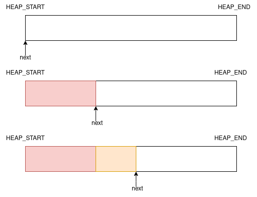
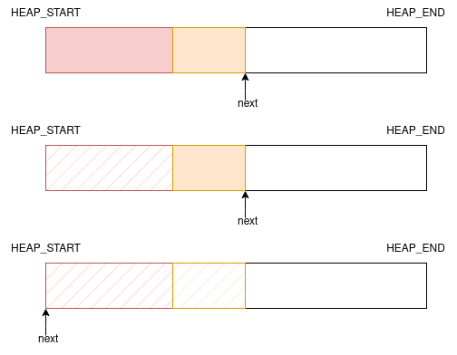
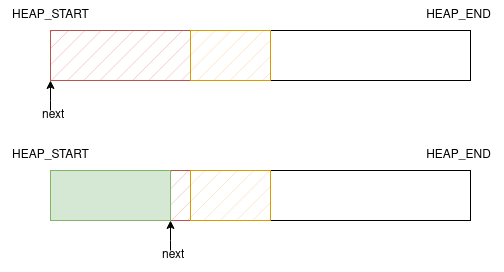

# KMALLOC

## Bump Allocator

The most simple allocator design implemented for `kmalloc()` is a "bump allocator". This basic allocator simply has a `next` ptr which will point to the next availible block in the heap.

Each time we allocate more memory, the `next` ptr is just 'bumped' along. Freeing memory does *not* move this pointer back, as we don't keep track of what blocks are where. The only time the pointer moves backwards is if *all* of the heap is free'd.

From here we can just overwrite the previously allocated memory.

This is the only allocation method that we will use for now. Later, we will replace this with a buddy allocator.